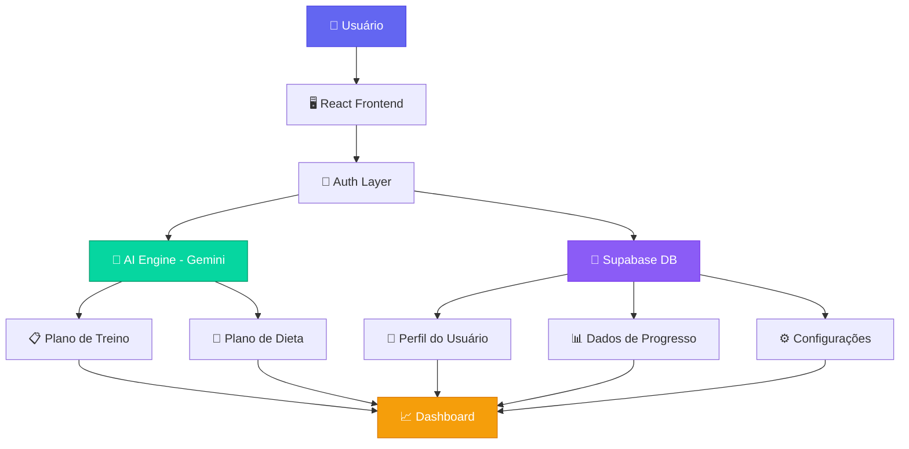

# 🏋️‍♂️ WebGym
### *Seu Treinador de Fitness Digital Pessoal powered by AI*

<div align="center">


[](https://github.com/Lusxka/WebGymView/stargazers)
[](https://github.com/Lusxka/WebGymView/network)
[](https://github.com/Lusxka/WebGymView/issues)
[](LICENSE)

**[🚀 Demo ao Vivo](https://webgym-demo.vercel.app)** • **[📚 Documentação](https://docs.webgym.app)** • **[🐛 Reportar Bug](https://github.com/Lusxka/WebGymView/issues)**

</div>

---

## 🌟 **Sobre o Projeto**

WebGym é um **treinador de fitness digital pessoal** que usa **inteligência artificial** para ajudar você a atingir seus objetivos de saúde. A aplicação permite que você faça login com segurança, crie um perfil detalhado e, em seguida, a IA gera planos semanais de treino e dieta personalizados. Você pode acompanhar seu progresso diário e alternar entre os modos escuro e claro para uma experiência mais confortável.

<div align="center">

```ascii
    🤖 IA Personalizada    📊 Tracking Completo    🔒 100% Seguro
         ↓                        ↓                     ↓
    Planos Únicos         Progresso Visual      Dados Protegidos
```

</div>

---

## ✨ **Recursos Principais**

<table>
<tr>
<td width="50%">

### 🔐 **Autenticação & Segurança**
- ✅ Registro e login seguro
- ✅ JWT tokens para proteção
- ✅ Dados criptografados
- ✅ Acesso apenas para usuários autenticados

### 🤖 **IA Personalizada**
- ✅ Powered by **Google Gemini**
- ✅ Planos de treino únicos
- ✅ Dietas personalizadas
- ✅ Adaptação baseada em progresso

### 💾 **Persistência Total**
- ✅ Database Supabase
- ✅ Sincronização em tempo real
- ✅ Backup automático
- ✅ Acesso multi-dispositivo

</td>
<td width="50%">

### 🧙‍♂️ **Onboarding Intuitivo**
- ✅ Formulário multi-etapas
- ✅ Coleta de dados inteligente
- ✅ UI/UX otimizada
- ✅ Experiência guiada

### 📈 **Dashboard Completo**
- ✅ Interface de abas organizada
- ✅ Centro de comando fitness
- ✅ Navegação intuitiva
- ✅ Métricas em tempo real

### 🎨 **Experiência Premium**
- ✅ Modo claro/escuro
- ✅ Design responsivo
- ✅ Animações fluidas
- ✅ Preferências salvas

</td>
</tr>
</table>

---

## 🛠️ **Stack Tecnológica**

<div align="center">

### **Frontend**


### **Backend & IA**


### **Deploy & Tools**


</div>

---

## 🏗️ **Arquitetura do Sistema**



---

## 📝 **Licença**

Este projeto está licenciado sob a Licença MIT - veja o arquivo [LICENSE](LICENSE) para detalhes.

---

## 💬 **Contato & Suporte**

<div align="center">

**Lusxka** - Desenvolvedor Principal

[](https://github.com/Lusxka)
[](https://linkedin.com/in/lusxka)
[](mailto:lusxka@email.com)

---


**Se este projeto te ajudou, considere dar uma ⭐!**

</div>


